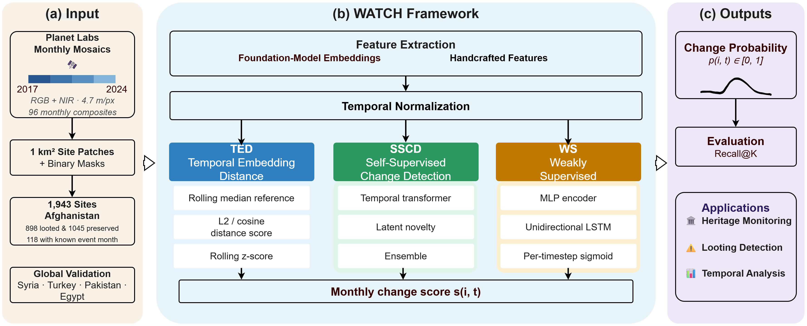
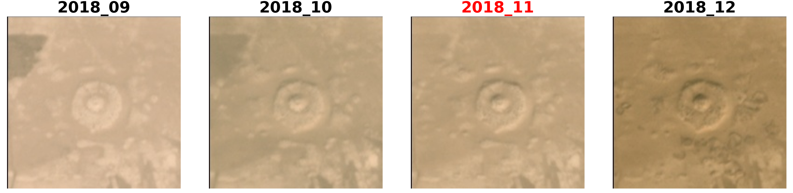
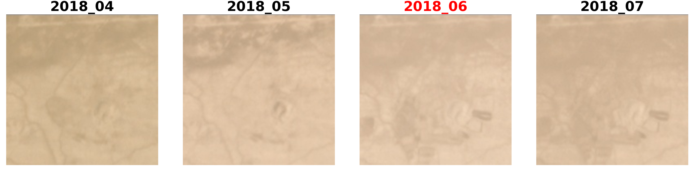
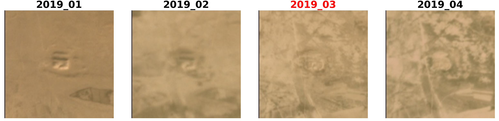
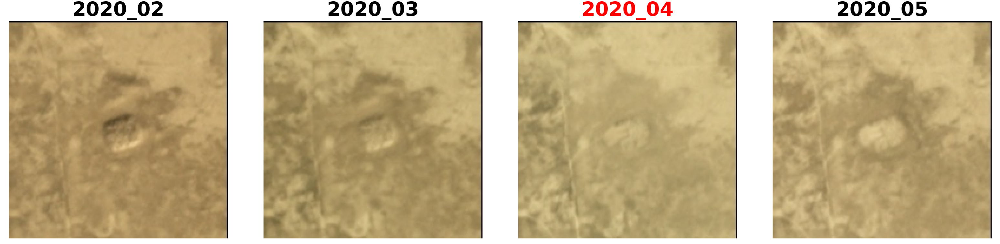

# WATCH: Wide-Area Archaeological Site Tracking for Change Detection

Monitoring archaeological sites at scale is critical for cultural heritage preservation, yet remains challenging due to sparse ground truth, subtle visual signals, and the need to determine *when* disturbances occur rather than merely *whether* they occurred.
We introduce **WATCH**, a framework for temporal change detection that operates on foundation-model embeddings extracted from Planet Labs monthly satellite mosaics (2017 to 2024, 4.7 m/px).
WATCH supports two complementary pipelines: (i) an unsupervised scoring approach that detects temporal deviations through distance-based and learned ensemble signals, and (ii) a weakly supervised temporal localization model trained with sparse, temporally truncated labels.
We evaluate WATCH on 1,943 archaeological sites in Afghanistan using embeddings from six geospatial foundation models alongside handcrafted spectral and texture features, and further test generalization on sites in Syria, Turkey, Pakistan, and Egypt.
Unsupervised methods consistently match or exceed weakly supervised alternatives, while handcrafted features remain competitive under certain scoring regimes.
Directional margin analysis reveals systematic temporal biases across methods, providing actionable insight for configuring early-warning versus confirmation-oriented monitoring.
Overall, WATCH demonstrates that foundation-model embeddings, combined with label-efficient temporal scoring, enable scalable and operationally meaningful monitoring of archaeological sites.

## Framework Overview

<p align="center">
  
</p>

**Figure:** Overview of the WATCH framework. (a) PlanetScope monthly mosaics (RGB+NIR, 4.7 m/px, 2017–2024) are processed into 1 km² site patches with binary masks for 1,943 archaeological sites in Afghanistan. (b) Foundation-model embeddings and handcrafted features are extracted and temporally normalized, then scored via three complementary pipelines: TED (Temporal Embedding Distance), SSCD (Self-Supervised Change Detection), and WS (Weakly Supervised), each producing a monthly change score. (c) Scores are converted to change probabilities and evaluated using Recall@K with symmetric and directional temporal margins, supporting heritage monitoring, looting detection, and temporal analysis applications.

## Global Distribution of Archaeological Sites

<p align="center">
  
</p>

**Figure:** Global distribution of sites with highlighted countries of interest.

## Examples of Looted Sites

<p align="center">
  <br>
  <br>
  <br>
  
</p>

**Figure:** Examples of Afghanistan archaeological sites for which the month of looting is known. The months preceding the observed looting, the month of looting itself (shown in red), and the following month are shown to illustrate the temporal progression of looting activity.

---

## Pipelines

This repository provides a standardized, end-to-end month-level change detection workflow based on:

1) extracting per-site monthly embeddings (foundation models or handcrafted), then
2) running one (or more) maintained monthly pipelines:
   - **TED (Temporal Embedding Distance)** (no training): `unsupervised_monthly` `distance_baseline` mode
   - **SSCD (Self-Supervised Change Detection)** (train once, then export): `unsupervised_monthly` `learned_unsupervised` mode
   - **WS (Weakly Supervised)** (train on month labels up to a cutoff): `weakly_supervised_monthly`

All three pipelines output a per-site probability distribution over months (columns `2017_01..2024_12`) and share the same evaluation tooling.

---

## 1) Data Layout

The maintained monthly pipelines assume:

```
planet_mosaics_final_4bands/
├── images/
│   ├── <site_name>/
│   │   ├── 2017_01.tif
│   │   ├── 2017_02.tif
│   │   └── ...
│   └── ...
├── masks_buffered/                  # optional but recommended
│   ├── <site_name>/mask.tif
│   └── ...
└── ground_truth_split_balanced_aux.csv
```

Ground-truth CSV requirements (minimum):

- `site_name`
- `split` (e.g., `train|val|test|all`)
- `looted` in `{0,1}`
- `looted_month` as `YYYY_MM` for looted sites (or empty/None)

---

## 2) Installation

The runners assume an environment with the repo dependencies installed. The provided shell runners default to a local venv named `change_detect`.

```bash
python -m venv change_detect
source change_detect/bin/activate
pip install -r requirements.txt
```

---

## License

This project is licensed under the MIT License. See `LICENSE`.

## Third-party

Third-party dependency attributions are listed in `THIRD_PARTY_NOTICES.md`.

## Privacy / security notes

- This repository does not ship datasets or model checkpoints.
- Do not hardcode API keys/tokens in code or config. Use environment variables.
- Avoid absolute machine-specific paths; the runners and extractors default to repo-relative paths.

---

## 3) Feature Extraction (One Standard Entry Point)

Use the unified extractor wrapper:

```bash
./extract_embeddings.sh --help
```

### 3.1 Afghanistan / per-site monthly embeddings (recommended)

This produces one embedding per `(site_name, month)` and writes a CSV with columns:
`site_name, month, f0..fN`.

Recommended output directory for the monthly pipelines:

- `planet_mosaics_final_4bands/features_unified_new_with_mask/`

Example (masked) for one embedding:

```bash
./extract_embeddings.sh --mode site \
   --model handcrafted \
   --images-root planet_mosaics_final_4bands/images \
   --use-mask --masks-root planet_mosaics_final_4bands/masks_buffered \
   --start-year 2017 --end-year 2024 \
   --output-dir planet_mosaics_final_4bands/features_unified_new_with_mask
```

This produces (example):

- `planet_mosaics_final_4bands/features_unified_new_with_mask/features_handcrafted_2017_2024_masked.csv`

Foundation models are supported too. Download models with:

```bash
# List available model IDs
python download_hf_models.py --list

# Download specific models (examples)
python download_hf_models.py --models dinov3 prithvi-eo-2.0 satmae satclip

# Download everything
python download_hf_models.py --models all
```

Then extract features, e.g.:

```bash
./extract_embeddings.sh --mode site \
   --model dinov3 \
   --images-root planet_mosaics_final_4bands/images \
   --use-mask --masks-root planet_mosaics_final_4bands/masks_buffered \
   --start-year 2017 --end-year 2024 \
   --device cuda:0 \
   --output-dir planet_mosaics_final_4bands/features_unified_new_with_mask
```

### 3.2 Global / grid embeddings (optional)

If you are running global site collections where each site is large and should be tiled into km² grids, use:

```bash
./extract_embeddings.sh --mode grid --model dinov3 --grid-area 1.0 --min-valid-ratio 0.1 \
   --images-root <global_images_root> \
   --start-year 2017 --end-year 2024 \
   --output-dir <output_dir>
```

Grid outputs include `grid_id, lon, lat` columns and are separate from the monthly Afghanistan-style pipelines.

---

## 4) Run Monthly Pipelines

All runners assume you activated the environment:

```bash
source change_detect/bin/activate
```

### 4.1 TED (Temporal Embedding Distance)

Start runs (one tmux session per embedding), then merge/evaluate/aggregate:

```bash
# Start tmux sessions (all default embeddings)
bash unsupervised_monthly/run_baseline_pipeline.sh start

# After sessions finish, merge + evaluate + aggregate
bash unsupervised_monthly/run_baseline_pipeline.sh all
```

Outputs:

- Unified score matrix (per embedding):
   - `unsupervised_monthly/model_runs/<embedding>/unsup_month_scores_all_distance_baseline_new.csv`
- Per-embedding metrics:
   - `unsupervised_monthly/results/<embedding>/<embedding>_distance_baseline_{test|all}_metrics{,_positive,_negative}.csv`

### 4.2 SSCD (Self-Supervised Change Detection)

```bash
# Start tmux sessions (all default embeddings)
bash unsupervised_monthly/run_unsupervised_pipeline.sh start

# After sessions finish, merge + evaluate + aggregate
bash unsupervised_monthly/run_unsupervised_pipeline.sh all
```

Outputs:

- Unified score matrix (per embedding):
   - `unsupervised_monthly/model_runs/<embedding>/unsup_month_scores_all_learned_unsupervised_new.csv`

### 4.3 Weakly-supervised monthly

This trains a lightweight sequence model using month labels only up to a cutoff (default `LABEL_END_MONTH=2020_12`), then exports a full `2017_01..2024_12` probability table.

```bash
# Start runs (one tmux session per embedding)
bash weakly_supervised_monthly/scripts/run_weakly_supervised_monthly.sh start

# Aggregate recall tables across embeddings
bash weakly_supervised_monthly/scripts/run_weakly_supervised_monthly.sh aggregate
```

Outputs:

- Unified score matrix (per embedding):
   - `weakly_supervised_monthly/model_runs/<embedding>/unsup_month_scores_all_weakly_supervised.csv`
- Per-embedding metrics:
   - `weakly_supervised_monthly/results/<embedding>/<embedding>_weakly_supervised_{test|all}_metrics{,_positive,_negative}.csv`

The default knobs for each pipeline are documented in the runner scripts themselves:

- `unsupervised_monthly/run_baseline_pipeline.sh`
- `unsupervised_monthly/run_unsupervised_pipeline.sh`
- `weakly_supervised_monthly/scripts/run_weakly_supervised_monthly.sh`

---

## 5) Evaluation + Inference Tables

### 5.1 Export a single "all sites × all months" inference table

This materializes stable inference tables under each pipeline’s `results/<embedding>/` folder:

```bash
python export_merged_monthly_inference_tables.py --pipelines all --year_start 2017 --year_end 2024
```

Examples of exported artifacts:

- `unsupervised_monthly/results/<embedding>/inference_all_months_distance_baseline.csv`
- `unsupervised_monthly/results/<embedding>/inference_all_months_learned_unsupervised.csv`
- `weakly_supervised_monthly/results/<embedding>/inference_all_months_weakly_supervised.csv`

Each has columns: `site_name, known_month_of_change, 2017_01..2024_12`.

### 5.2 Aggregated recall tables (monthly / top-k / margins)

The pipeline runners call the evaluator automatically, but you can run it manually:

```bash
python -m unsupervised_monthly.evaluate_unified_monthlies \
   --scores_csv <path_to_unsup_month_scores_all_*.csv> \
   --mode distance_baseline \
   --split test \
   --top_k 12 \
   --max_margin 6 \
   --directional \
   --groundtruth_csv planet_mosaics_final_4bands/ground_truth_split_balanced_aux.csv \
   --results_dir <output_results_dir> \
   --embedding <embedding_id>
```

To aggregate recall summaries across embeddings:

```bash
python unsupervised_monthly/aggregate_recalls.py
```

---
## Model Architecture

The monthly pipelines support multiple feature extraction backends:

1. **Handcrafted features**: Spectral indices (NDVI, BSI, etc.) computed directly from 4-band imagery
2. **Foundation model embeddings**: DINOv3, Prithvi-EO-2.0, SatMAE, SatCLIP, GeoRSCLIP, Satlaspretrain

These embeddings feed into three scoring pipelines:

- **TED (Temporal Embedding Distance)**: Detects change by measuring embedding drift over time (no training required)
- **SSCD (Self-Supervised Change Detection)**: Trains an ensemble of reconstruction / forecasting / novelty heads, then exports month-level scores
- **WS (Weakly Supervised)**: Trains a lightweight sequence model using month labels up to a cutoff date

## Evaluation Metrics

The system evaluates:
- **Temporal Localization**: Month prediction accuracy within configurable tolerance (top-k, margin)
- **Recall**: Per-embedding and aggregated recall at varying temporal margins
- **Score distributions**: Histograms and directional change analysis

## Requirements

- Python 3.11 (tested with 3.11)
- PyTorch version as specified in `requirements.txt`
- Rasterio version as specified in `requirements.txt`
- All dependencies are pinned in `requirements.txt`

## License

This project is licensed under the MIT License - see the LICENSE file for details.

---

## Quick Start Cheat Sheet

### 1. Feature Extraction

All feature extraction goes through the unified entry point:

```bash
# Per-site monthly embeddings (Afghanistan pipeline)
./extract_embeddings.sh --mode site \
   --model handcrafted \
   --images-root planet_mosaics_final_4bands/images \
   --use-mask --masks-root planet_mosaics_final_4bands/masks_buffered \
   --start-year 2017 --end-year 2024 \
   --output-dir planet_mosaics_final_4bands/features_unified_new_with_mask

# Foundation model example (DINOv3)
./extract_embeddings.sh --mode site \
   --model dinov3 \
   --images-root planet_mosaics_final_4bands/images \
   --use-mask --masks-root planet_mosaics_final_4bands/masks_buffered \
   --start-year 2017 --end-year 2024 \
   --device cuda:0 \
   --output-dir planet_mosaics_final_4bands/features_unified_new_with_mask

# Global grid embeddings (optional, for large-area tiling)
./extract_embeddings.sh --mode grid \
   --model satmae \
   --images-root planet_mosaics_final_4bands/images \
   --start-year 2017 --end-year 2024 \
   --output-dir planet_mosaics_final_4bands/features_unified_global_without_mask
```

### 2. Run Pipelines

```bash
# TED (Temporal Embedding Distance)
bash unsupervised_monthly/run_baseline_pipeline.sh start   # launch tmux sessions
bash unsupervised_monthly/run_baseline_pipeline.sh all     # merge + evaluate

# SSCD (Self-Supervised Change Detection)
bash unsupervised_monthly/run_unsupervised_pipeline.sh start
bash unsupervised_monthly/run_unsupervised_pipeline.sh all

# WS (Weakly Supervised)
bash weakly_supervised_monthly/scripts/run_weakly_supervised_monthly.sh start
bash weakly_supervised_monthly/scripts/run_weakly_supervised_monthly.sh aggregate
```

### 3. Global Inference (All Embeddings)

```bash
# TED — global
bash unsupervised_monthly/run_baseline_global.sh

# SSCD — global
bash unsupervised_monthly/run_unsupervised_global.sh

# WS — global
bash weakly_supervised_monthly/scripts/run_weakly_supervised_monthly_global.sh
```

### 4. Export Inference Tables

```bash
python export_merged_monthly_inference_tables.py --pipelines all --year_start 2017 --year_end 2024
```

---

## Citation

If you use WATCH in your research, please cite:

```bibtex
@article{tadesse2026watch,
  title={WATCH: Wide-Area Archaeological Site Tracking for Change Detection},
  author={Tadesse, Girmaw Abebe and Bartette, Titien and Hassanali, Andrew and Kim, Allen and Chemla, Jonathan and Zolli, Andrew and Ubelmann, Yves and Robinson, Caleb and Becker-Reshef, Inbal and Ferres, Juan Lavista},
  journal={arXiv preprint},
  year={2026}
}
```

---